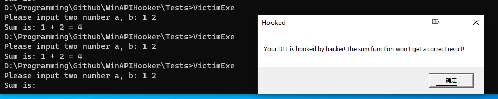

# WinAPIHooker
Windows API Hooker.

## Development Environment

IDE: Visual Studio 2019

## Demonstration

## References

[1] https://www.exploit-db.com/docs/english/13140-api-interception-via-dll-redirection.pdf

[2] https://docs.microsoft.com/en-us/windows/win32/dlls/dynamic-link-library-redirection

[3] https://r00tk1ts.github.io/2017/12/28/API%20Interception%20via%20DLL%20Redirection/

[4] https://cloud.tencent.com/developer/article/1883437

[5] https://docs.microsoft.com/en-us/cpp/build/reference/module-definition-dot-def-files?view=msvc-160

[6] https://docs.microsoft.com/en-us/cpp/build/stack-usage?view=msvc-170

[7] https://docs.microsoft.com/en-us/cpp/build/x64-calling-convention?view=msvc-170&viewFallbackFrom=vs-2019
